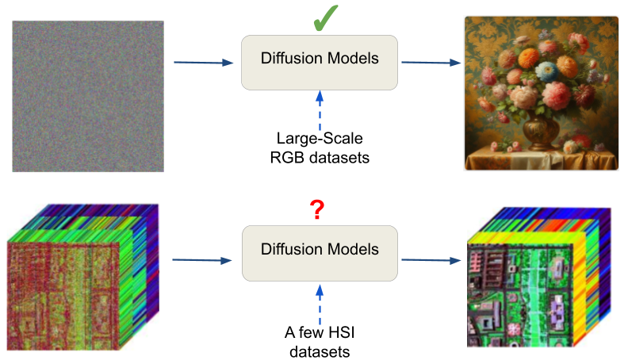
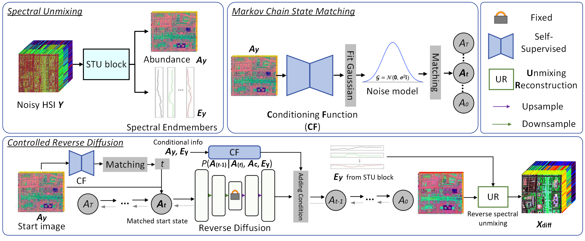

<a href="https://openaccess.thecvf.com/content/CVPR2024/papers/Zeng_Unmixing_Diffusion_for_Self-Supervised_Hyperspectral_Image_Denoising_CVPR_2024_paper.pdf"><strong>Diff-Unmix: Unmixing Diffusion for Self-Supervised Hyperspectral Image Denoising</strong></a>

There is a follow-up work with much better performance and new design: <a href="https://openreview.net/pdf?id=Q150eWkQ4I"></strong>Spectral Compressive Imaging via Unmixing-driven Subspace Diffusion Refinement</strong></a>

>

  

> Hyperspectral images (HSIs) have extensive applications in various fields such as medicine, agriculture, and industry. Nevertheless, acquiring high signal-to-noise ratio HSI poses a challenge due to narrow-band spectral filtering. Consequently, the importance of HSI denoising is substantial, especially for snapshot hyperspectral imaging technology. While most previous HSI denoising methods are supervised, creating supervised training datasets for the diverse scenes, hyperspectral cameras, and scan parameters is impractical. In this work, we present Diff-Unmix, a self-supervised denoising method for HSI using diffusion denoising generative models. Specifically, Diff-Unmix addresses the challenge of recovering noise-degraded HSI through a fusion of Spectral Unmixing and conditional abundance generation. Firstly, it employs a learnable block-based spectral unmixing strategy, complemented by a pure transformer-based backbone. Then, we introduce a self-supervised generative diffusion network to enhance abundance maps from the spectral unmixing block. This network reconstructs noise-free Unmixing probability distributions, effectively mitigating noise-induced degradations within these components. Finally, the reconstructed HSI is reconstructed through unmixing reconstruction by blending the diffusion-adjusted abundance map with the spectral endmembers. Experimental results on both simulated and real-world noisy datasets show that Diff-Unmix achieves state-of-the-art performance.
>

  

We use a pre-trained diffusion model provied by <a href="https://github.com/wgcban/ddpm-cd">DDPM-CD Repository</a>. The pre-trained condition function and spectral unmixing network can be downloaded from <a href="https://drive.google.com/file/d/1l_jPrgy6ZnINEk6JV1W2o7OiABXyZwke/view?usp=drive_link"> here </a>.

This implementation is based on / inspired by:

<a href="https://github.com/wyhuai/DDNM">DDNM Repository</a>

<a href="https://github.com/bahjat-kawar/ddrm">DDRM Repository</a>

<a href="https://github.com/wgcban/ddpm-cd">DDPM-CD Repository</a>

<a href="https://github.com/StanfordMIMI/DDM2">DDM2 Repository</a>

<a href="https://arxiv.org/pdf/2305.10925">PLRDiff</a>

